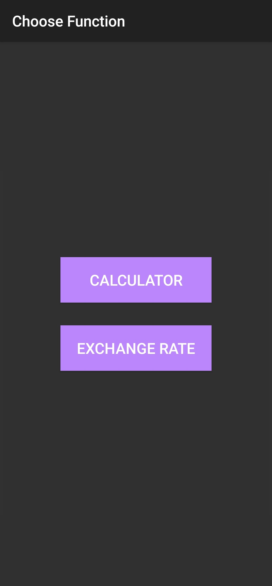
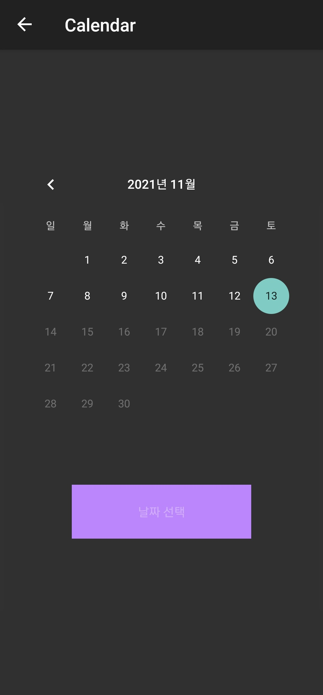
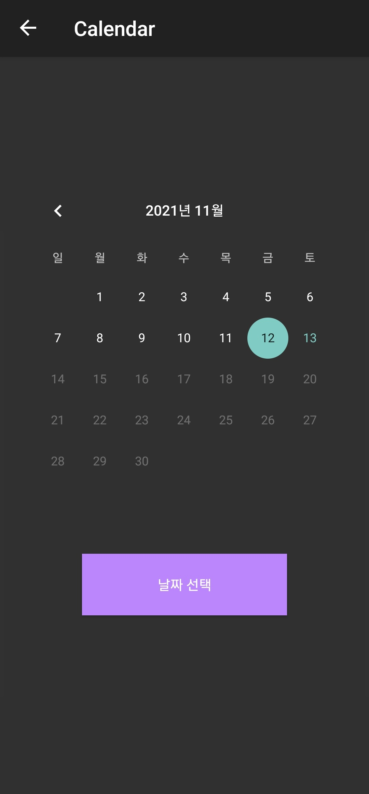
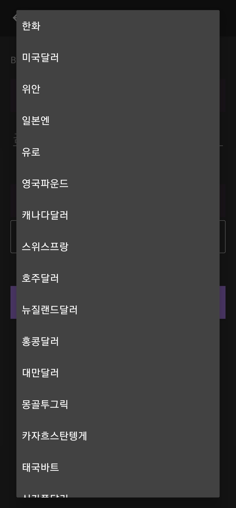
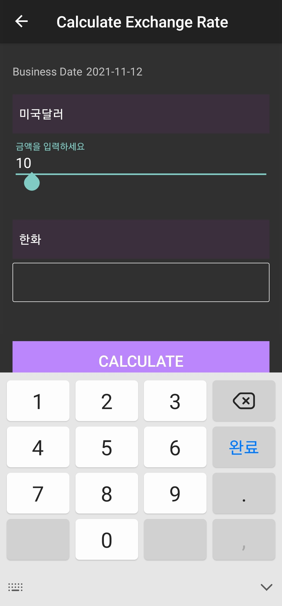
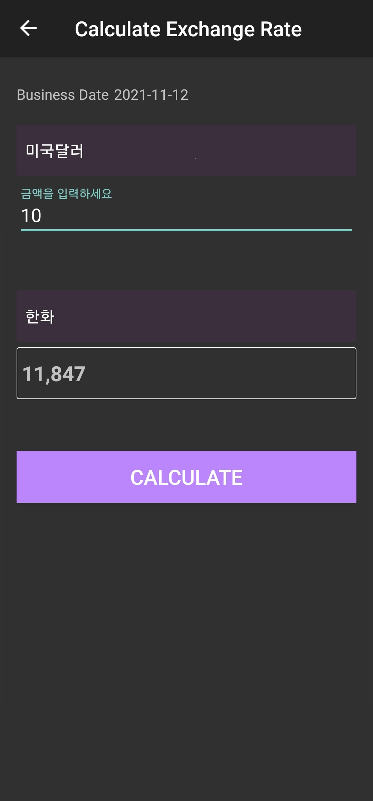
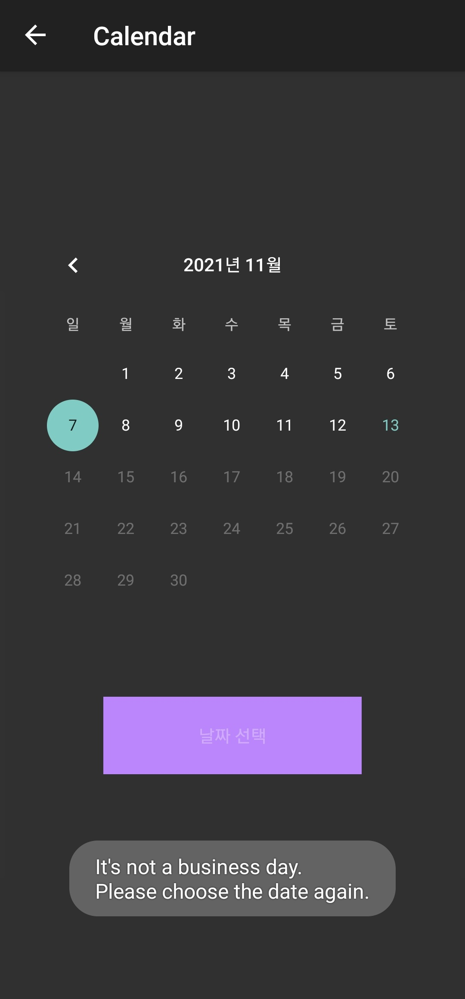
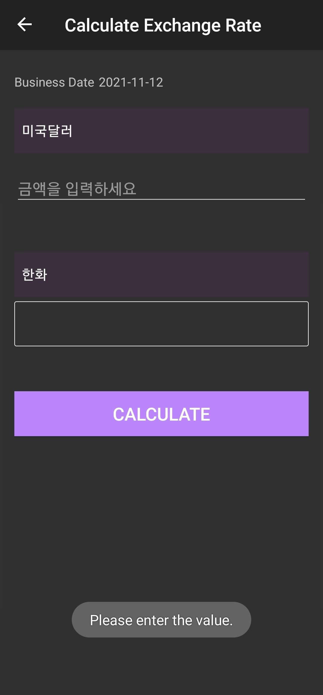
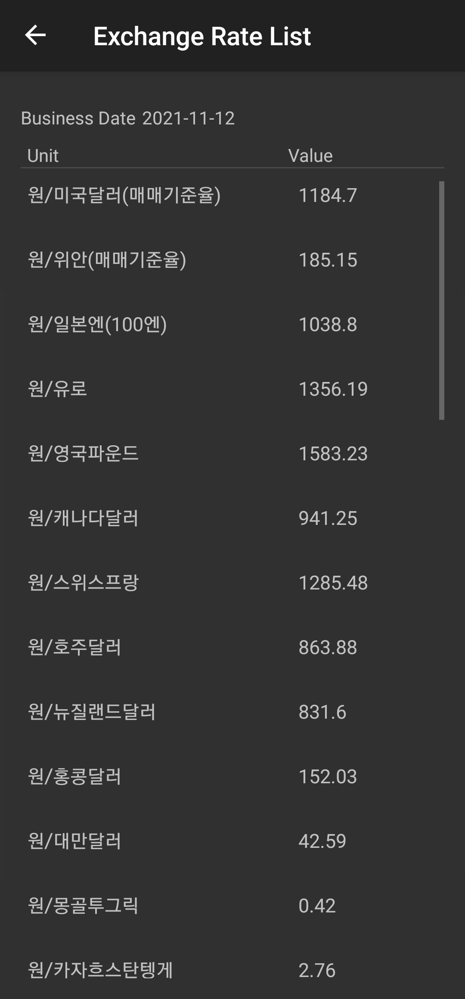
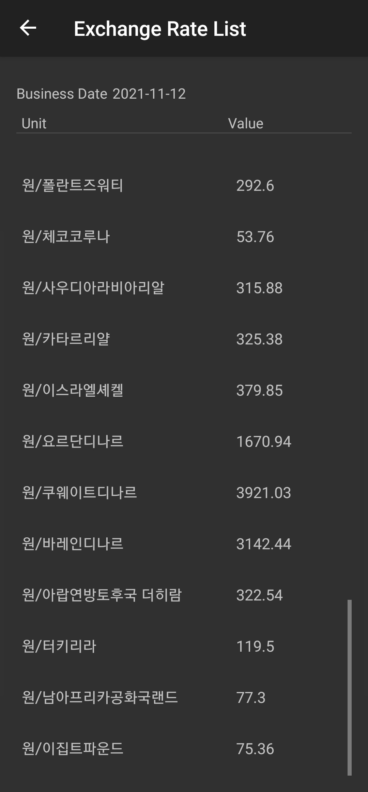

## Exchange Rate Calculator

### 기능 1. 환율 계산기
1. 시작화면에서 'CALCULATOR' 버튼 클릭
2. 날짜 선택   
3. 입력 단위 선택
4. 금액 입력
5. 출력 단위 선택
6. 'CALCULATE'버튼 클릭
 

|  | | |
|:-:|:-:|:-:|
|  |  |  |

  

- 영업일이 아닌 날짜 선택 시 
  

  

- 금액을 입력하지 않고 'CALCULATE'버튼 클릭 시 
  

  

### 기능 2. 환율 조회

1. 시작화면에서 'EXCHANGE RATE' 버튼 클릭 
2. 날짜 선택
 

|  | | |
|:-:|:-:|:-:|
|  |  | |